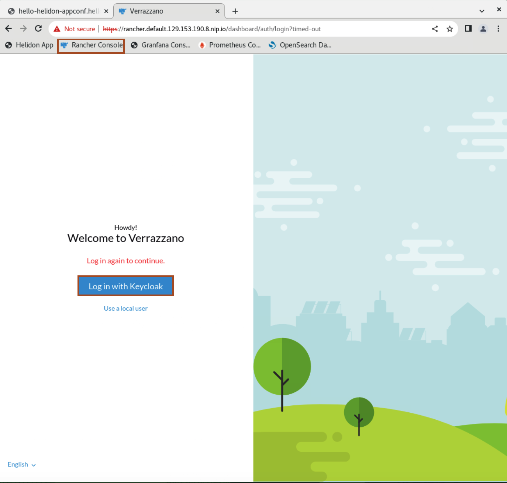
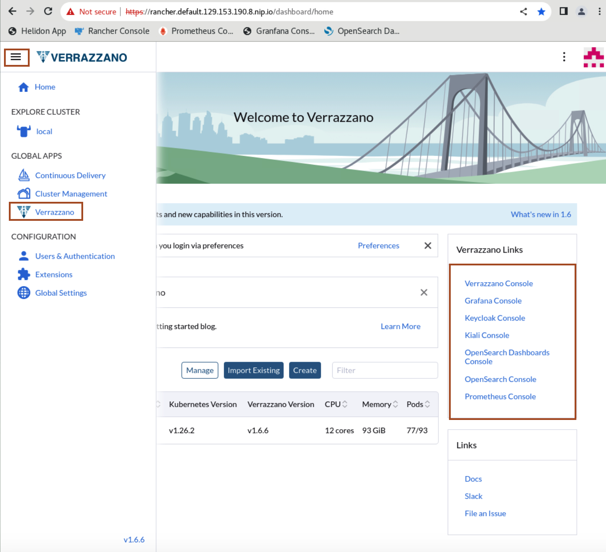
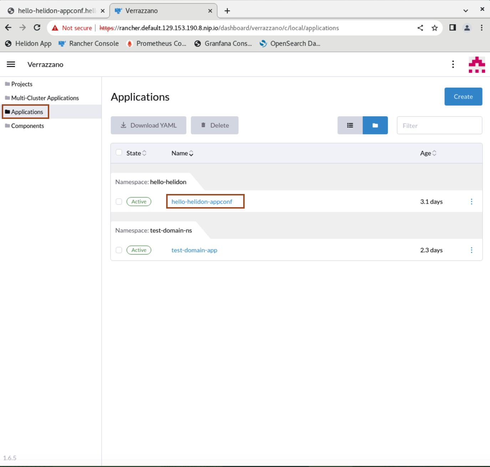
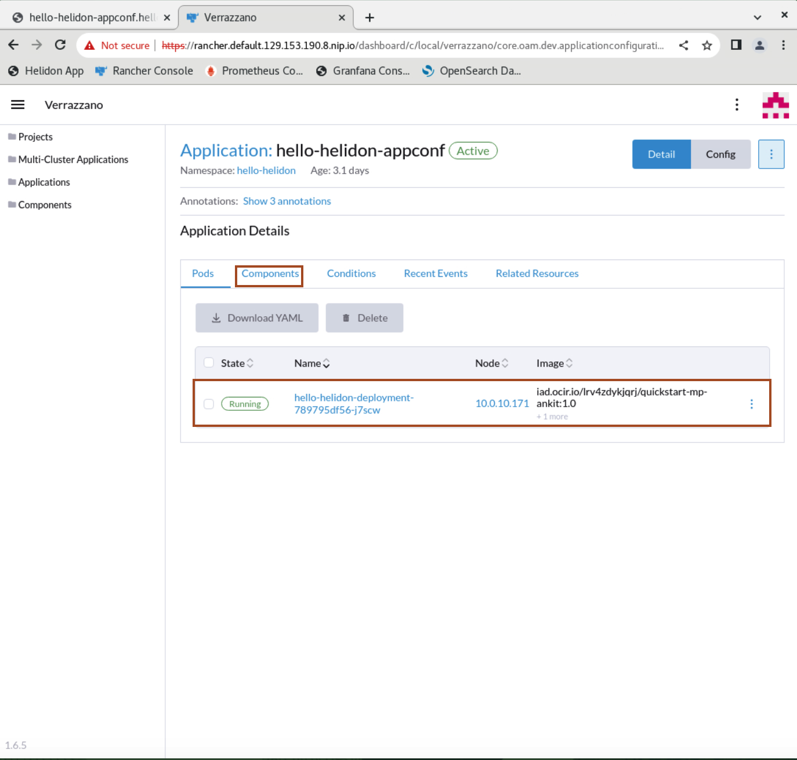
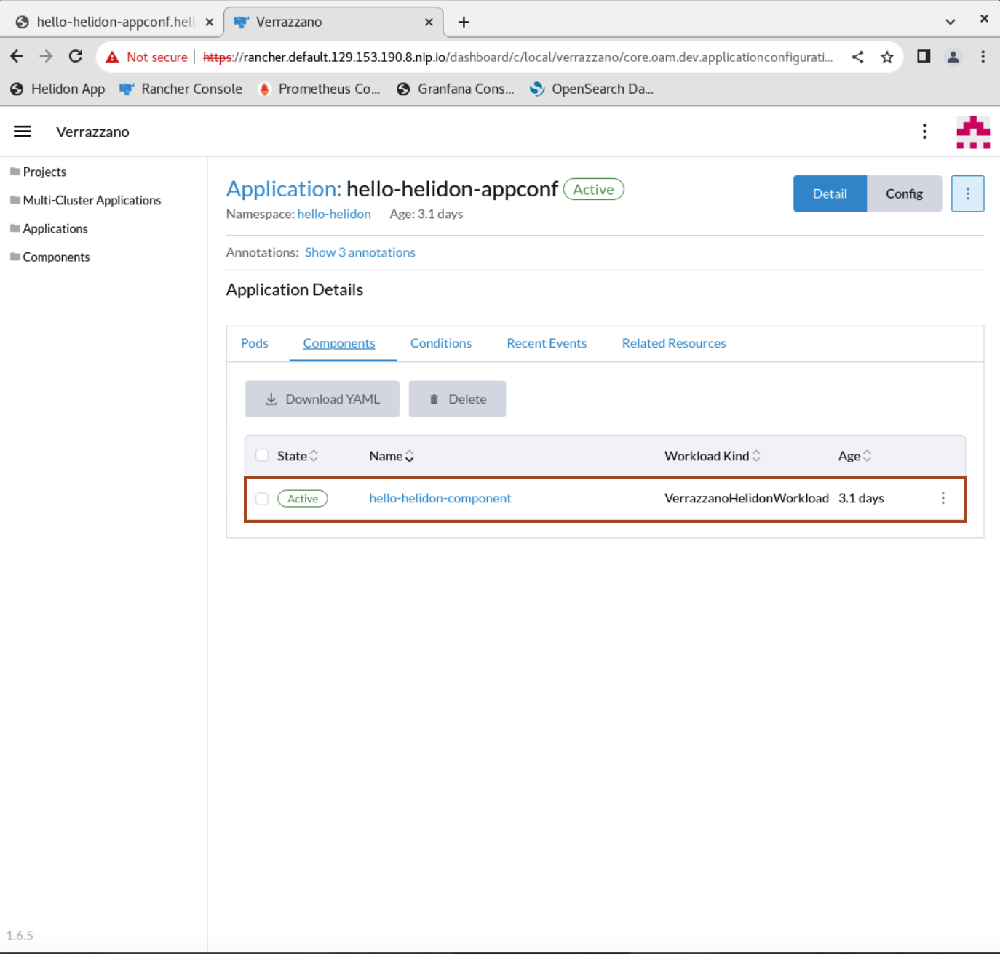
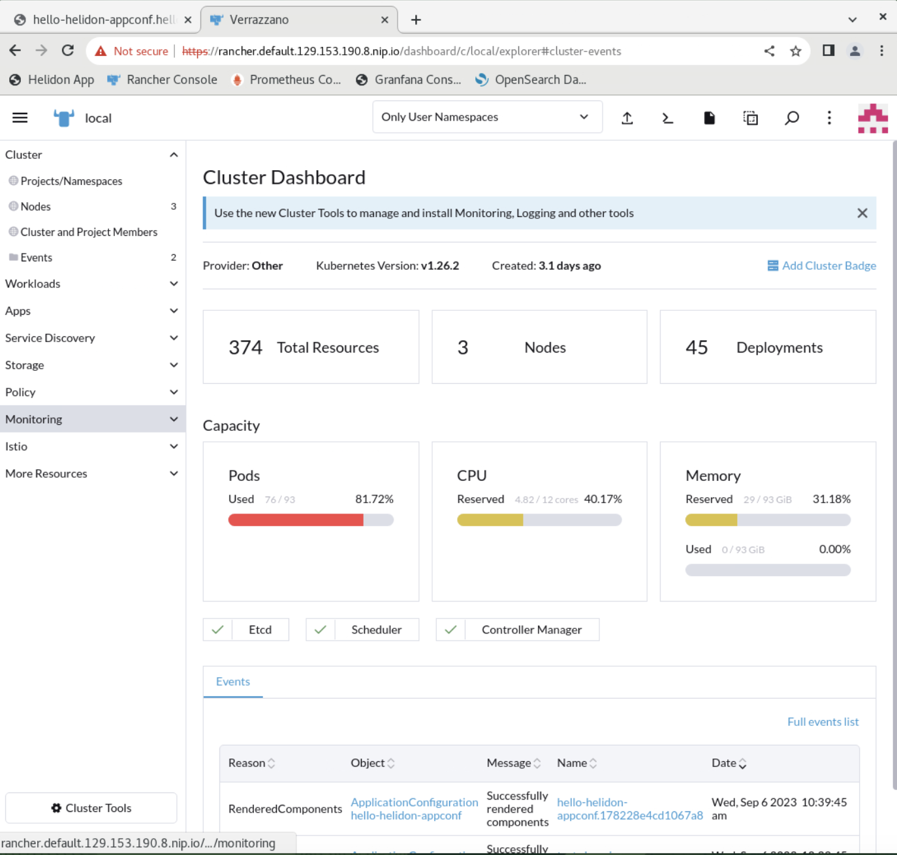
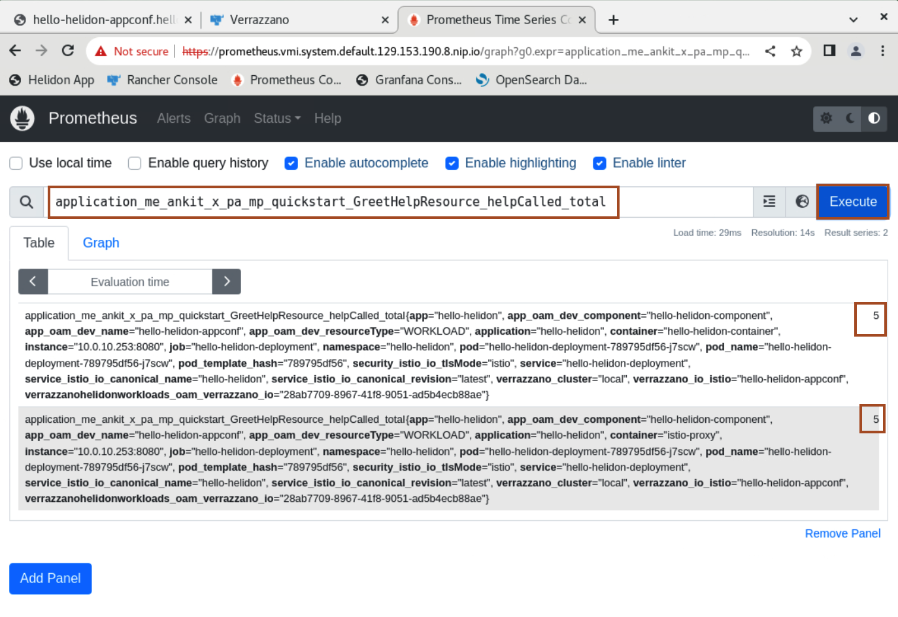
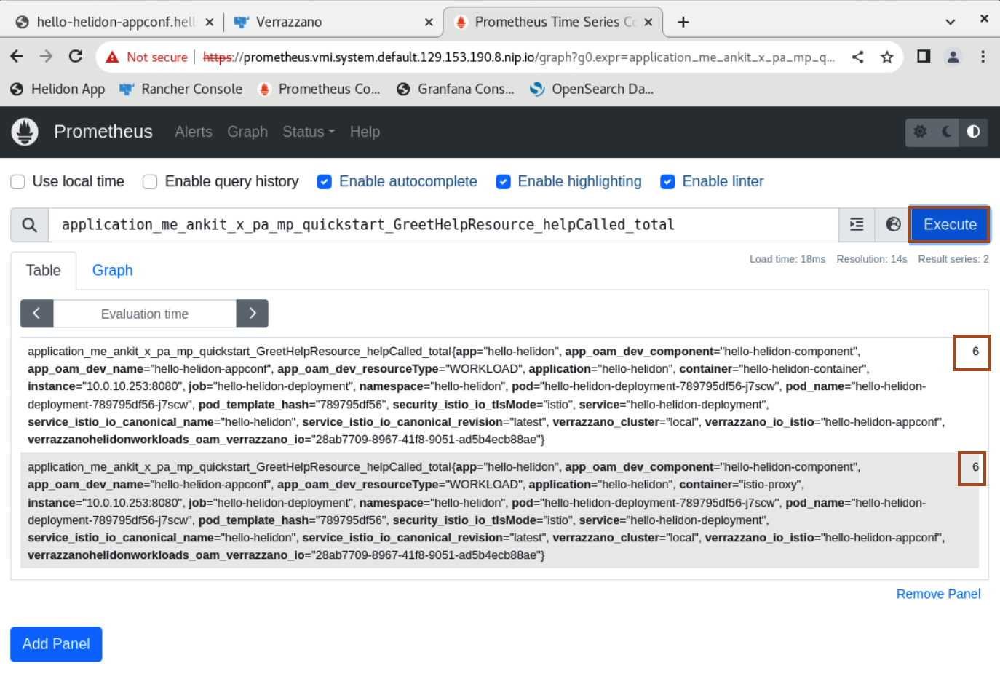
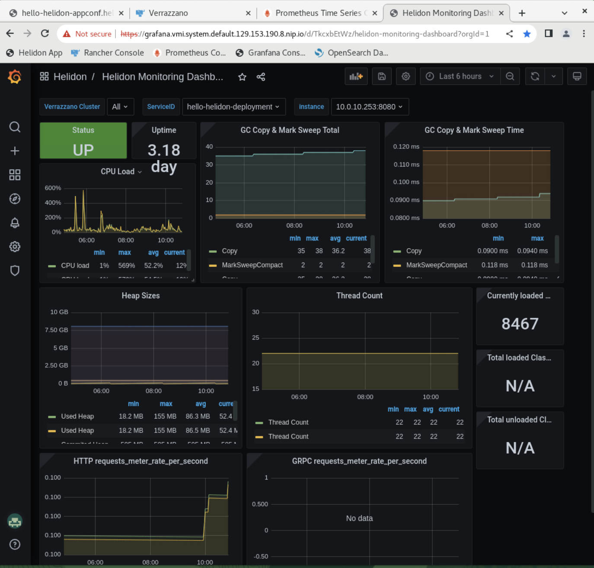
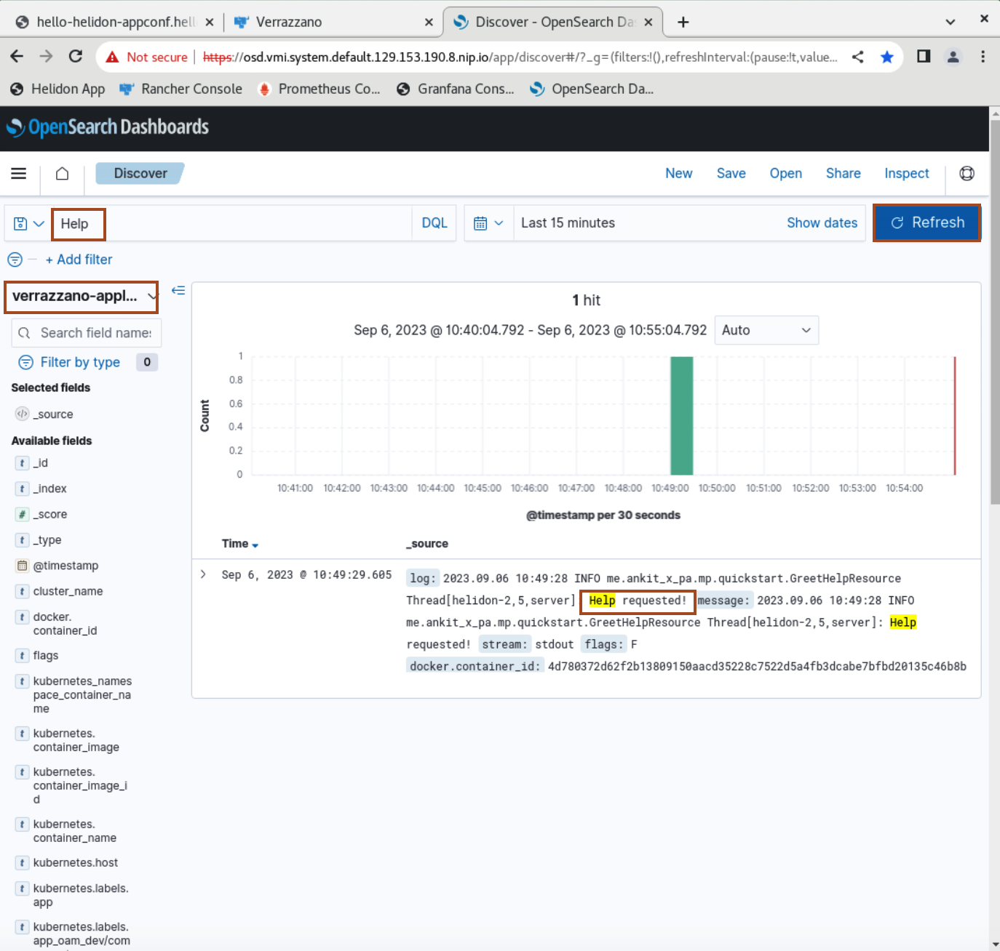

# Monitor and Manage Helidon Application through Verrazzano

## Introduction

We have deployed the Helidon **quickstart-mp** application. In this lab, we will access the application and explore multiple management tool provided by Verrazzano.

Estimated time: 05 minutes

### Objectives

In this lab, you will:

* Access the deployed helidon application.
* Explore the Rancher console.
* Explore the Prometheus console.
* Explore the WebLogic Dashboard in Grafana.
* Explore the Opensearch Dashboard.

Estimated time: 05 minutes

### Prerequisites

* You have access to the remote desktop [Helidon demo](http://129.213.29.119/livelabs/vnc.html?password=LiveLabs.Rocks_99&resize=scale&quality=9&autoconnect=true&reconnect=true).
* Verrazzano installed on a Oracle Kubernetes Cluster.
* Helidon *quickstart-mp* application is deployed to Oracle Kubernetes Cluster using Verrazzano.

## Task 1: Explore the Rancher Console

1. Open Chrome browser, Click the first Bookmark **Helidon App**. 
    

    > It confirm, Helidon application is successfully running on Kubernetes Cluster.

2. Open a new tab in Chrome browser and Click the second Bookmark **Rancher Console**. Click **Login with Keycloak**. Enter **verrazzano** as Username and **X7jve6ftLz3NKvY9** as Password and  then click **Sign in**.
    
    

3. From the home page of the rancher console, you can view the Verrazzano Links. you can access any of these consoles from rancher console.Click **Hamburger menu** -> **Verrazzano**.
    

4. Click **Applications**. This section shows all the applications with their namespace and is managed by Verrazzano. Click the **hello-helidon-appconf** application within the **hello-helidon** namespace.
    

5. You can view the pods associated with the application. The pod name contains an auto-generated unique string to identify that particular replica. To view the Component associated with the application, click **Components**.
    
    

6. Click **Hamburgar menu** -> **local**, to open the **Cluster Explorer**. The **Cluster Explorer** allows you to view and manipulate all of the custom resources and CRDs in a Kubernetes cluster from the Rancher UI.
    
    

## Task 2: Explore the Prometheus Console

1. Open a new tab in Chrome browser and Click the third Bookmark **Prometheus Console**.
    

2. On the Prometheus dashboard page type *help* into the search field and click your custom metric **application _me _user _mp _quickstart _GreetHelpResource _helpCalled _total**. Click **Execute** and check the result below. You should see your metric's current value which means how many requests were completed by your endpoint.
    

4. Access the Helidon application once again, by click the first bookmark and show the metric's value increased.
    

## Task 3: Explore the Grafana Console

1. Open a new tab in Chrome browser and Click the fourth Bookmark **Grafana Console**.
    

2. The Grafana home page opens. Click **Home** at the top left.

3. Type `Helidon` and you will see *Helidon Monitoring Dashboard* under **General**. Click **Helidon Monitoring Dashboard**.

4. Observe the JVM details of the Helidon *quickstart-mp* application such as Status, Heap Usage, Running Time, JVM Heap, Thread Count, HTTP Requests, etc. This is a prebuilt dashboard specifically for Helidon workloads. Of course, you can customize this dashboard according to your needs and add custom diagnostics information.
    

## Task 4: Explore the OpenSearch Dashboard

1. Open a new tab in Chrome browser and Click the fifth Bookmark **Opensearch Dashboard**.
    

2. Select the *`verrazzano-application*`* namespace as shown and then type the custom log entry value you created in the Helidon application: `help ` into the filter textbox. Press **Enter** or click **Refresh**. You should get at least one result. 
    

    > If you haven't hit the application endpoint, or that happened a long time ago, simply invoke the helidon application again.

## Acknowledgements

* **Author** -  Ankit Pandey
* **Contributors** - Maciej Gruszka, Sid Joshi
* **Last Updated By/Date** - Ankit Pandey, September 2023
